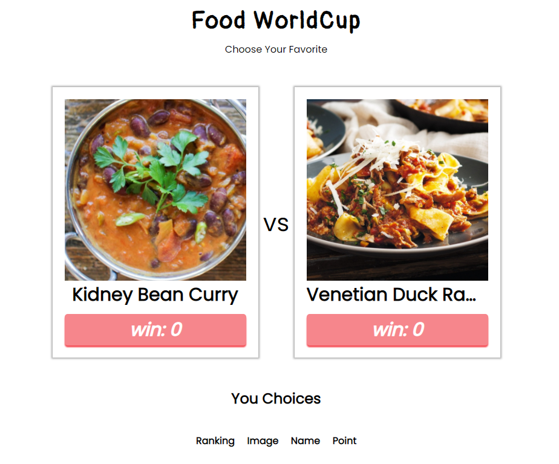

# 음식 월드컵

  

 

[meal api](https://www.themealdb.com/api.php)를 사용하여 만든 음식 월드컵입니다.

다만, 기존 월드컵과는 달리 밀어내기씩으로 진행이됩니다.

 

## 함수

- **API 관련**
  - `request(api)` : api를 받아서 데이터를 반환함
  - `async getRandomMeal()`: 랜덤으로 음식 데이터를 얻음

- **throttle**
  - `makeThrottle()`
    throttle 를 만듬, 버튼을 여러번 클릭 되는 것을 방지

 

## 클래스

- **FoodCard** : 비교되는 음식 카드

  - **parameter** :
    - `$target` : `this.wrpper`를 `appendChild()`할 _DOMnode_
    - `handleClick` : 버튼 클릭시 핸들링되는 함수
    - `uniqueList = []` : 현재까지 가지고 있었던 음식 id

  - **속성**
    - `this.wrpper` : 카드의 wrapper
    - `this.data` : 음식의 정보가 들어갈 객체
    - `this.uniqueList` : 현재까지 바뀌어온
    - `this.button` : 해당 음식을 선택하는 버튼

  - **메서드**
    - `isInUniqueList(target_id)` : 해당 아이디가 `this.uniqueList` 안에 있는지 확인
    - `pushUniqueList(target_id)` : 해당 아이디를 `this.uniqueList` 에  삽입
    - `initUniqueList(target_id)` : `this.uniqueList`를 `[target_id]`으로 만듦
    - `async changeRandomMeal()` : 랜덤으로 음식정보를 가져옴 그리고 `render()`
    - `render()` : innerHTML로 노드들을 `this.wrpper`에 넣음

 
  
- **RankingTable** : 랭킹 테이블

  - **parameter** :
    - `target` : `this.$table`을 `appendChild()`할 _DOMnode_

  - **속성**
    - `new_tr` : 새로운 table row 인 DOM 객체(`<tr>`)

  - **메서드**
    - `addItem({ id, preview, name, win = 0 })`: parameter에 따른 table row를 추가
    - `rankCalculate()` : 랭크를 계산(아이템을 넣은 후 랭크를 재계산할 때 사용)

 

- **Modal** : 모달

  - **parameter** :
    - `target` : `this.modalWrapper`를 `appendChild()`할 _DOMnode_

  - **속성**
    - `this.active` : 현재 모달이 띠워졌는지?
		- `this.data` : 모달에서 보여줄 정보(음식에 대한 이름, 사진, 나라, 주재료, 유투브 링크)를 가진 객체
		- `this.modalWrapper` :  모달 배경과 모달을 감싸는 wrapper

  - **메서드**
    - `toggle()`: 모달의 `hidden` 클래스를 토글하여 모달을 보이고 사라지게함
    - `async modalOpen(id)` : 해당 음식의 `id`로 음식의 상세 정보 가져옴
    - `render()` : 모달을 그림

