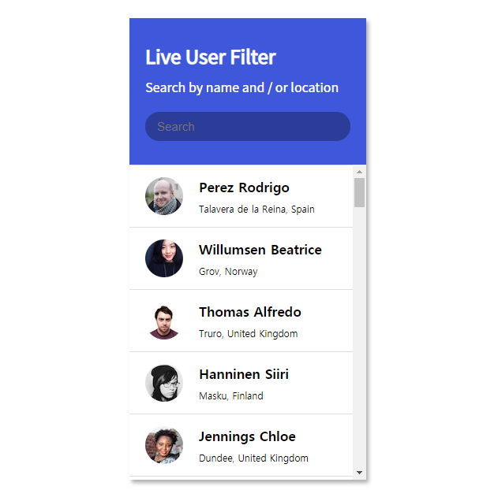

# 라이브 필터링

  

 

- 사용자의 이름 혹은 장소명에 따라 필터링이 가능
- `debouncer` 로 연속 입력에도 바로 필터링하지 않음
- [https://randomuser.me/](https://randomuser.me/) API를 사용해 랜덤 사용자 정보 가져옴
- 정규 표현식을 사용하여 필터링
- React, `useState()`, `useEffect()` 활용
- purejs로 구현된 [https://codepen.io/FlorinPop17/full/pooQmjO](https://codepen.io/FlorinPop17/full/pooQmjO)을 참조함

 

- **codepen** : [https://codepen.io/1tbhard/pen/QWNxrGx](https://codepen.io/1tbhard/pen/QWNxrGx)
