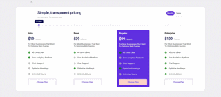

# Pricing

  

[dribbble의 Erşad Başbağ의 디자인](https://dribbble.com/shots/14070207-Pricing-Section-01/attachments/5689861?mode=media)을 적용해서 만든 페이지

 

## 사용된 기술

- **react**
  - reactHook(`useState`, `useEffect`, `useContext`)
  - `refs`
- **scss**
  - **mixin**으로 media query 처리

 

## 하면서 어려웠던 점

1. component의 깊이가 깊어지면서 전파해야할 props를 처리하는게 힘들었음
    - `createContext()`, `useContext()`로 해결

2. input range 의 스타일링이 힘들었음

- 브라우저마다 달리 적용되는 `<input>`의 가상 요소를 찾아 각각 스타일링을 해줘야했음(하지만 scss로 써서 css보다는 단축됨)
  - `:root`의 변수를 JS에서 조절하여 채워지는 색상 `gradient()`로 처리함
- 커스텀한 `<input>`의 thumb(핸들러)에 **말풍선**을 띄우는게 어려웠음
  - js로 `<input>`의 값만큼 말풍선을 이동시킴

<br.>

## 아쉬운 점

눈금 간격을 `<input>` 바깥에 선언한 요소를 주먹구구식으로 css 값을 조절하여 맞춘 사실
